# Mermaid Verification Examples

This document is used to verify Mermaid rendering in MarkHola `v0.6.2`.

## Flowchart

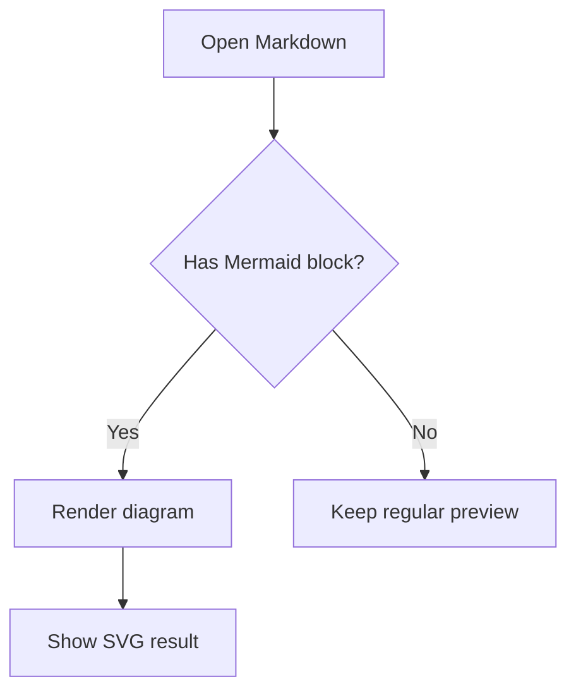

## Sequence Diagram

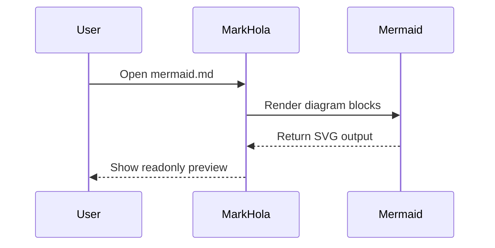

## Class Diagram

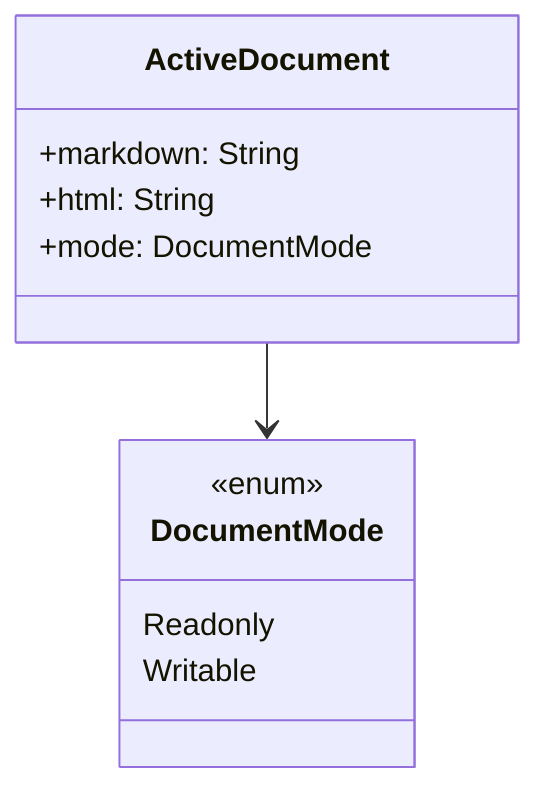

## State Diagram

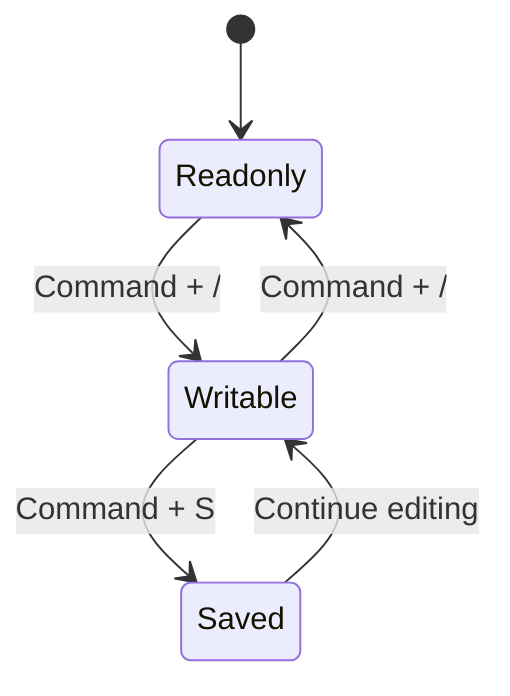

## Entity Relationship

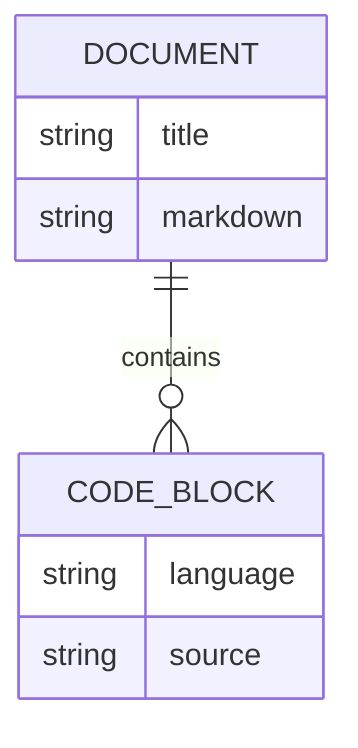

## Gantt

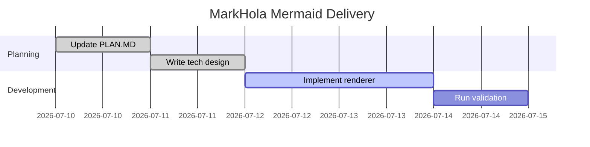

## Pie

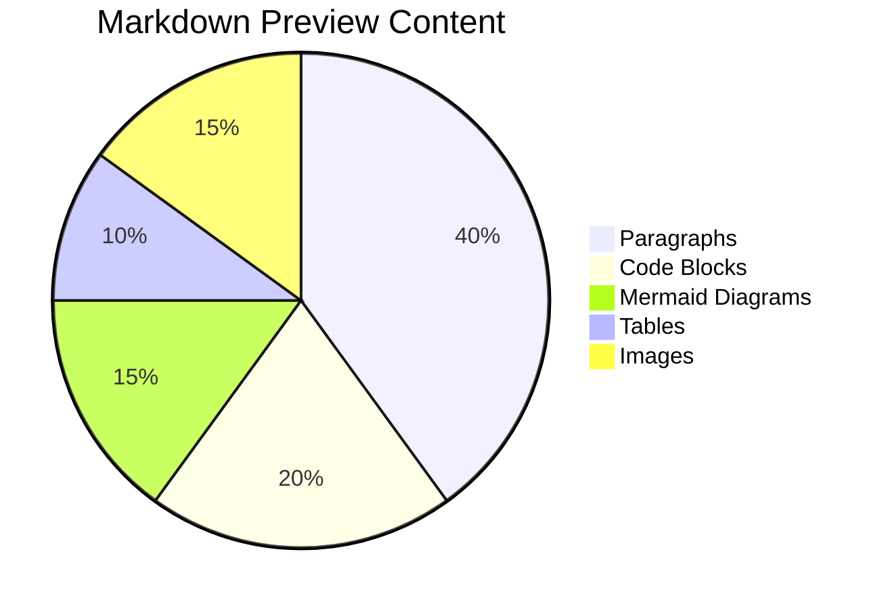

## Journey

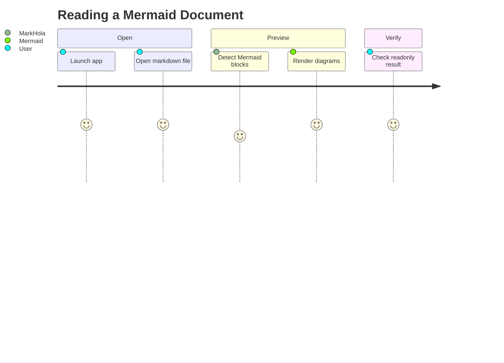

## Git Graph

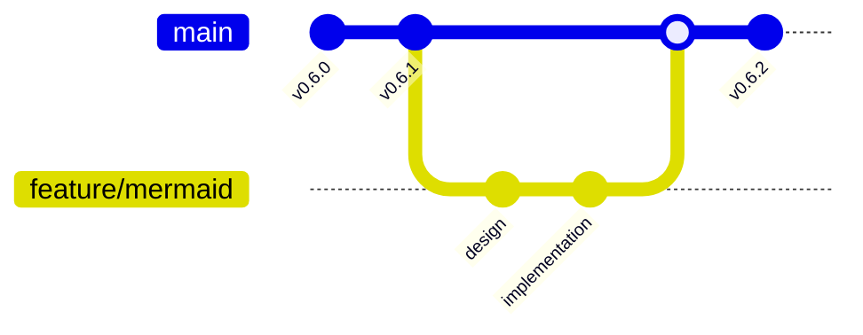

## Mindmap

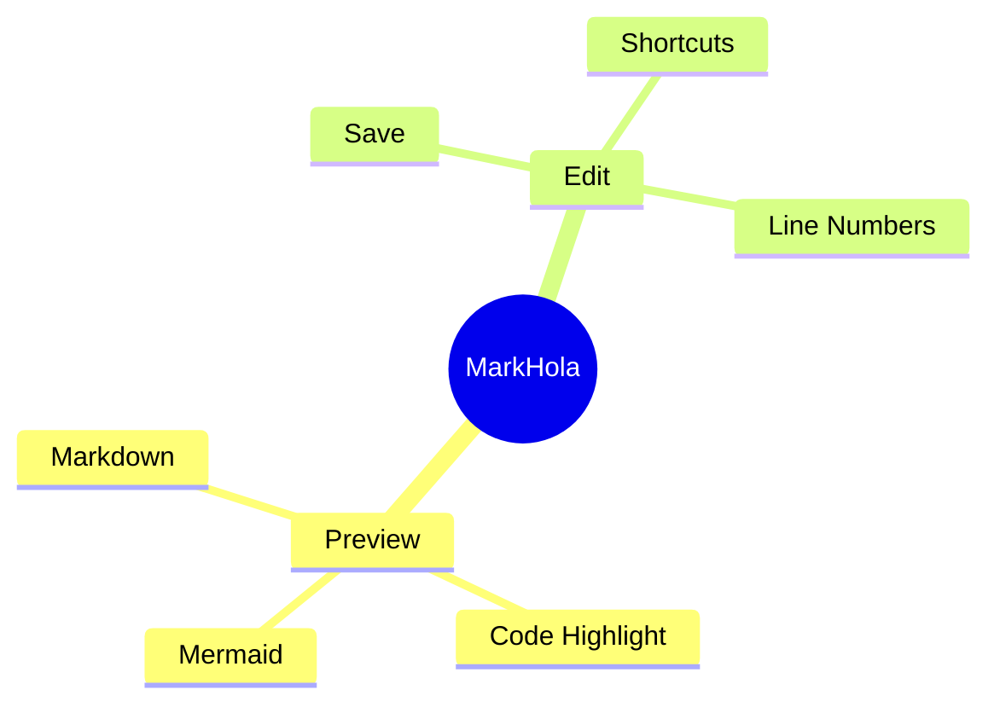

## Timeline

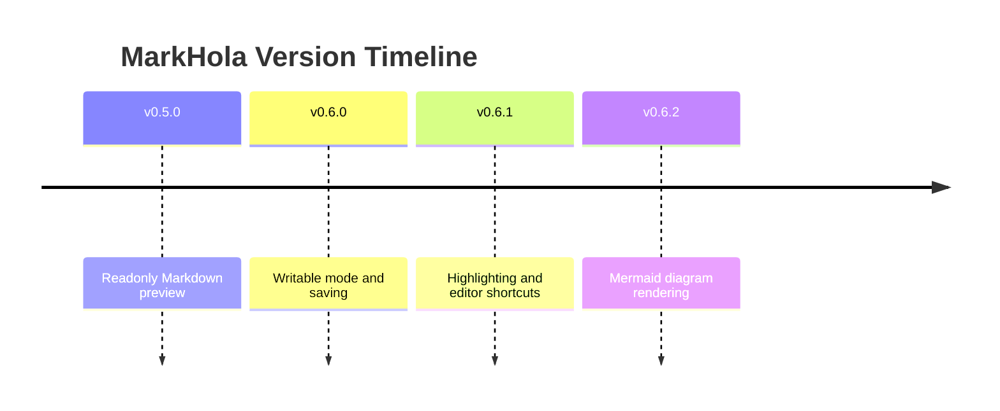

## Sankey

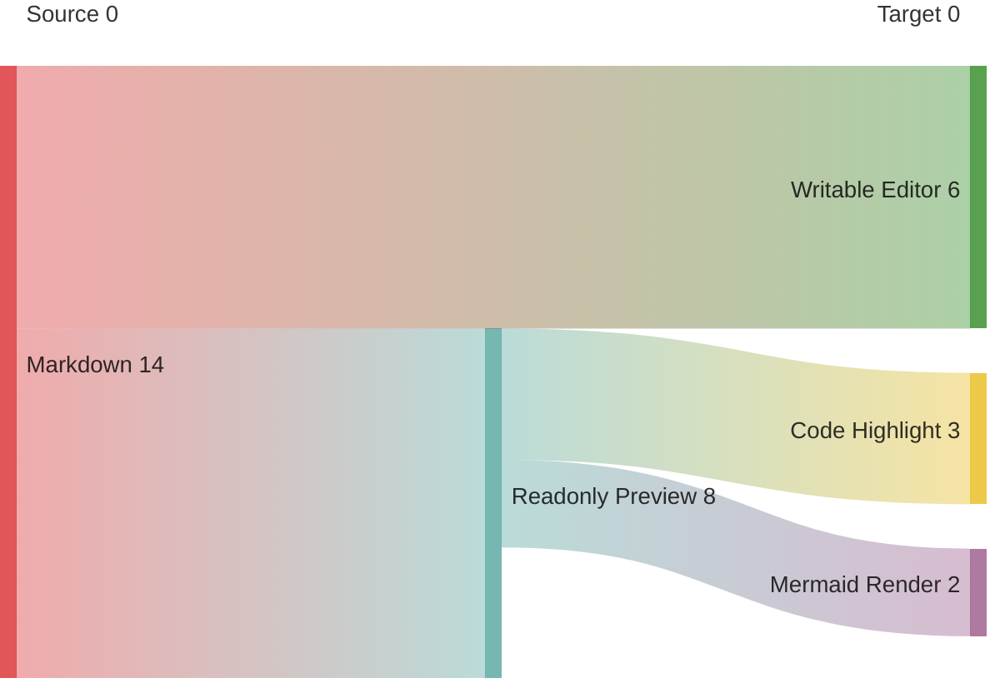

## Error Fallback Sample

The block below is intentionally invalid and should fail locally without breaking the rest of the document.

```mermaid
flowchart TD
  A -->
```
